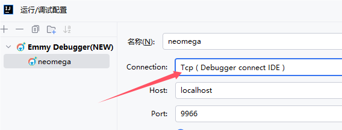

## 使用 vscode 调试 neomega 的 lua 插件的代码

此部分教程分为三个部分：
- 关键步骤
- 完整步骤
- 视频演示 (在群文件里)  
需要注意的只有关键步骤，不必完全按完整步骤来。  
不过如果你还未上手，可能需要完整步骤和视频演示的帮助。 

<video src="./resource/omega-luadebug.mp4" controls="controls" width="100%" height="100%"/>

### 关键步骤
- vscode 需要安装 EmmyLua 这个插件 [vscode下载](https://marketplace.visualstudio.com/items?itemName=tangzx.emmylua) [jetbrains Ide下载](https://plugins.jetbrains.com/plugin/9768-emmylua)
- 启动配置选择 EmmyLua New Debug
- 在 EmmyLua New Debug 生成的配置中， 将 "ideConnectDebugger": true 改为 "ideConnectDebugger": false
- 在代码的最外层（目前不能插入在协程中）插入代码片段:
```lua
local dbg = require('emmy_core')
dbg.tcpConnect('localhost', 9966)
print("waiting...")
for i=1,1000 do -- 调试器需要一些时间来建立连接并交换所有信息
    -- 如果始终无法命中断点，你可以尝试将 1000 改的更大
    print(".")
end
print("end")
```
- 在 print("end") 那行左侧打上断点
- 无论是何种情况，每次重启调试都应先启动或者重启 EmmyLua New Debug， 然后再 reload

### 完整步骤
- 打开 vscode, 并打开一个空目录
- vscode 需要安装 EmmyLua 这个插件
- 配置 EmmyLua 调试器的启动选项
    - 在 vscode 中按下 ctrl + shift + p 三个按键 (macos 用户应该是 command + shift + p)
    - 在弹出的命令框中输入 Open 'launch.json' 并选择
    - 在新打开的页面的右下角的 "添加配置" (Add Configuration)
    - 选择 EmmyLua New Debug
    - 在自动生成的配置中，将 "ideConnectDebugger": true 改为 "ideConnectDebugger": false
    - 此时，vscode 左侧边栏 运行和调试 (Run And Debug) 的上方会显示 EmmyLua New Debug 项目
  - 
- 若正确操作，此时目录下应该出现一个 .vscode 文件夹，文件夹内存在一个 launch.json 文件，文件内容如下:
    ```json
    {
        "version": "0.2.0",
        "configurations": [
            {
                "type": "emmylua_new",
                "request": "launch",
                "name": "EmmyLua New Debug",
                "host": "localhost",
                "port": 9966,
                "ext": [
                    ".lua",
                    ".lua.txt",
                    ".lua.bytes"
                ],
                "ideConnectDebugger": false
            }
        ]
    }
    ```
你也可以选择手动创建这个文件夹和文件，并填入上述内容

- 下载和启动 nomega （请参考 安装说明）注意最好在 vscode 中操作   
（终端可以从 vscode 的右上角打开，或同时按下 ctrl + j 这两个按键打开）  
- 创建一个插件以供调试
    - 正常启动 neomega   
    正常情况下，此时 .vscode 和 neomega_storage 应该处于同一级目录 
    - (在终端/后台)输入 create 并创建一个新插件 (此处假设你创建了一个叫 test 的插件)
    - 保持 neomega 继续运行，并打开这个新插件 (应该位于 neomega_storage/lang/LuaLoader/test.lua)
    - 解除此文件的 8-15 行的注释，并在 15 行左侧打上一个断点
    此时这个文件看上去像这样:
        ```lua
        local omega = require("omega")
        local json = require("json")
        local coromega = require("coromega").from(omega)

        coromega:print("config of test:  ",json.encode(coromega.config))

        -- 如果你需要调试请将下面一段解除注释，关于调试的方法请参考文档
        local dbg = require('emmy_core')
        dbg.tcpConnect('localhost', 9966)
        print("waiting...")
        for i=1,1000 do -- 调试器需要一些时间来建立连接并交换所有信息
            -- 如果始终无法命中断点，你可以尝试将 1000 改的更大
            print(".")
        end
        print("end")

        coromega:when_called_by_terminal_menu({
            triggers = { "test" },
            argument_hint = "[arg1] [arg2] ...",
            usage = "test",
        }):start_new(function(input)
            coromega:print("hello from test!")
        end)

        coromega:run()
        ```
    - 在 vscode 左侧边栏 运行和调试 (Run And Debug) 的上方启动 EmmyLua New Debug  
    此时右下角应该出现一个提示框，不用管它
    - 在终端 (就是后台) 输入 reload，稍等片刻。
    - 如果成功，调试器应该停在第 15 行
- 修改插件代码并继续调试
    - 在插件中执行你想要的修改，记得按下 ctrl + s 保存修改
    - 根据你的情况，从下面的行动二选一
        - 上一个调试还未结束 (vscode 顶部还有调试栏): 点击顶部调试栏的重启按钮
        - 上一个调试已经结束或还没开始调试: 在 vscode 左侧边栏 运行和调试 (Run And Debug) 的上方启动 EmmyLua New Debug，此时右下角应该出现一个提示框，不用管它
    - 输入 reload 即可继续调试 （此处的重点是 reload 应该后于 调试器启动）。

### 视频教程:
请移步群文件 (QQ群: 769061008)

::: details jetbrains Ide?
jetbrains ide提供了更详细的debug信息,EmmyLua选择如图

:::
